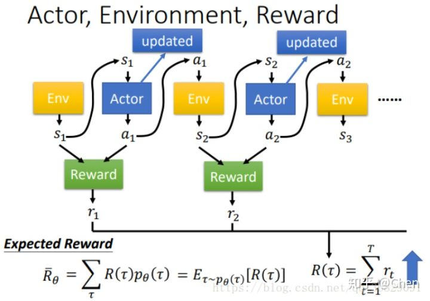

# Policy Gradient

假设agent有这样一个动作序列 $\{s_1,a_1,s_2,a_2,\dots,s_t,a_t\}$，我们称为trajectory $\tau$，一个迹存在的概率等于所有状态的状态转移概率的乘积。
$$
\begin{aligned}
p_{\theta}(\tau) &=p\left(s_{1}\right) p_{\theta}\left(a \mid s_{1}\right) p\left(s_{2} \mid s_{1}, a_{1}\right) p_{\theta}\left(a_{2} \mid s_{2}\right) \ldots \\
&=p\left(s_{1}\right) \prod_{t=1}^{T} p_{\theta}\left(a_{t} \mid s_{t}\right) p\left(s_{t+1} \mid s_{t}, a_{t}\right)
\end{aligned}
$$
一个迹结束后会返回一个reward，或是在每一步动作都反馈一个reward，RL的目标是调整动作选择策略，最大化reward期望。

我们可以使用梯度上升最大化 $\bar{R}_{\theta}=\sum_{\tau} R(\tau) p_{\theta}(\tau)=E_{\tau \sim p_{\theta}(\tau)}[R(\tau)]$，推导过程很复杂，反正经过计算，我们可以有：
$$
\begin{aligned}
&\theta \leftarrow \theta+\eta \nabla \bar{R}_{\theta} \\
&\nabla \bar{R}_{\theta}=\frac{1}{N} \sum_{n=1}^{N} \sum_{t=1}^{T_{n}} R\left(\tau^{n}\right) \nabla \log p_{\theta}\left(a_{t}^{n} \mid s_{t}^{n}\right)
\end{aligned}
$$
